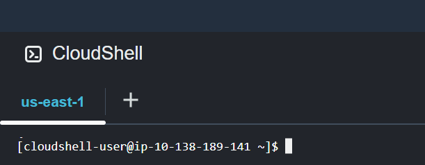

Author: Prof. Barbosa<br>
Contact: infobarbosa@gmail.com<br>
Github: [infobarbosa](https://github.com/infobarbosa)

# Objetivo

O objetivo deste repositório é criar uma instância (máquina virtual) no serviço AWS EC2 que servirá aos propósito de ambiente de laboratório.

## Atenção aos Custos!

A utilização dos serviços AWS pode gerar custos significativos, especialmente se os recursos forem deixados ativos após a conclusão do laboratório. É altamente recomendável monitorar os custos através do console de faturamento da AWS.

#### Recomendações:
- **Monitore os custos:** Utilize o AWS Cost Explorer para acompanhar os gastos.
- **Elimine recursos desnecessários:** Após finalizar o laboratório, certifique-se de eliminar todos os recursos criados, como instâncias EC2, VPCs, subnets, e qualquer outro serviço utilizado.

Utilize o procedimento ao final desta página para eliminar os recursos criados.


## 1. Região AWS

No console AWS verifique a região no topo à direita do console AWS, normalmente é **Norte da Virgínia** (`us-east-1`).<br>
**Não** altere essa configuração!
<div align="left">

</div>

## 2. CloudShell
Selecione o ícone do serviço *CloudShell*.<br>


Será disponibilizada o terminal do CloudShell:


### 3. Clonagem do repositório
Execute a seguinte instrução para clonar este repositório:
```
git clone https://github.com/infobarbosa/awsacademy-env.git
```

Output experado:
```
[cloudshell-user@ip-10-138-189-141 ~]$ git clone https://github.com/infobarbosa/awsacademy-env.git
Cloning into 'awsacademy-env'...
remote: Enumerating objects: 6, done.
remote: Counting objects: 100% (6/6), done.
remote: Compressing objects: 100% (6/6), done.
remote: Total 6 (delta 0), reused 6 (delta 0), pack-reused 0
Receiving objects: 100% (6/6), done.
[cloudshell-user@ip-10-138-189-141 ~]$ 
```

Navegue para o diretório clonado:
```
cd awsacademy-env/
```

### 4. CloudFormation - Criação do stack
Para criação da instância, vamos utilizar o script cloudformation `template.yaml` disponibilizado no repositório.<br>
A criação deve ser feita através do comando a seguir:
```
aws cloudformation create-stack --stack-name infobarbosa-stack --template-body file://template.yaml
```

Output esperado:
```
[cloudshell-user@ip-10-138-189-141 awsacademy-env]$ aws cloudformation create-stack --stack-name infobarbosa-stack --template-body file://template.yaml
{
    "StackId": "arn:aws:cloudformation:us-east-1:898985761452:stack/infobarbosa-stack/24d09450-51e3-11ef-a1f3-0affc644647b"
}
```

### 5. CloudFormation - Conferindo o stack
Verifique o status de criação através do seguinte comando:
```
aws cloudformation describe-stack-events --stack-name infobarbosa-stack
```

Output esperado:
```
[cloudshell-user@ip-10-138-189-141 awsacademy-env]$ aws cloudformation describe-stack-events --stack-name infobarbosa-stack  
{
    "StackEvents": [
        {
            "StackId": "arn:aws:cloudformation:us-east-1:898985761452:stack/infobarbosa-stack/24d09450-51e3-11ef-a1f3-0affc644647b",
            "EventId": "392903b0-51e3-11ef-a6ba-0affd5ec2d63",
            "StackName": "infobarbosa-stack",
            "LogicalResourceId": "infobarbosa-stack",
            "PhysicalResourceId": "arn:aws:cloudformation:us-east-1:898985761452:stack/infobarbosa-stack/24d09450-51e3-11ef-a1f3-0affc644647b",
            "ResourceType": "AWS::CloudFormation::Stack",
            "Timestamp": "2024-08-03T21:56:23.004000+00:00",
            "ResourceStatus": "CREATE_COMPLETE"
        },
...
...

```

### CloudFormation - Destruindo o stack
Após a finalização do laboratório, você deve eliminar os componentes através do comando:
```
aws cloudformation delete-stack --stack-name infobarbosa-stack
```

Este comando não produz uma saída. Porém, é possível conferir através do `describe-stack-events` novamente:
```
aws cloudformation describe-stack-events --stack-name infobarbosa-stack 
```


